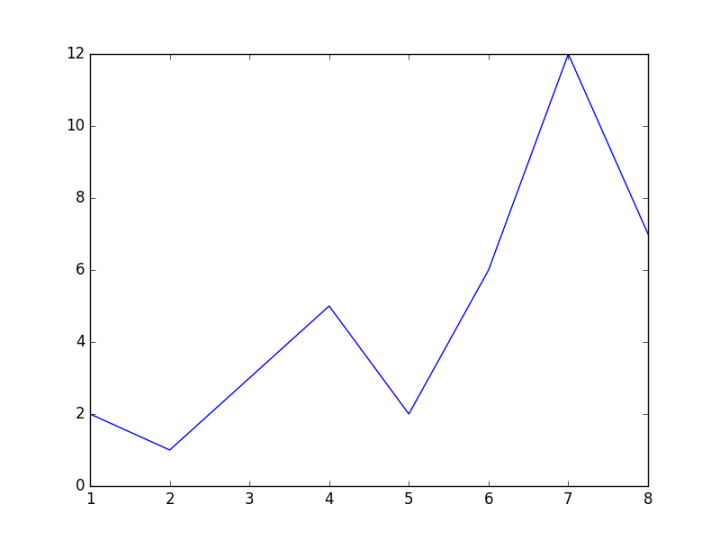
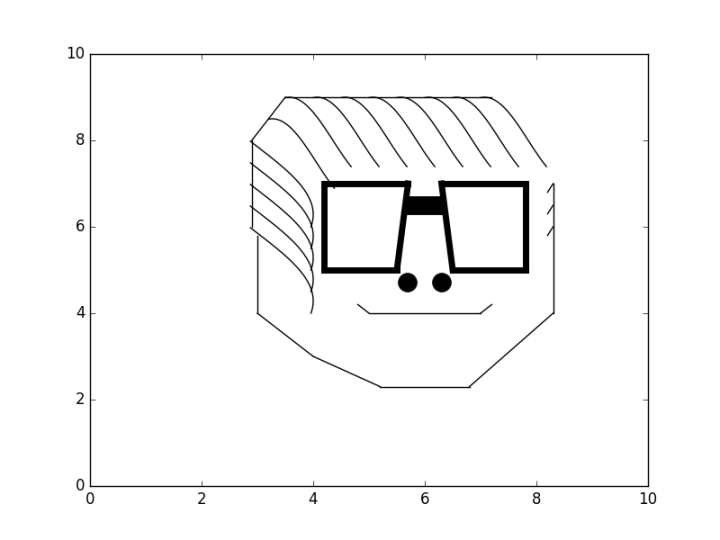
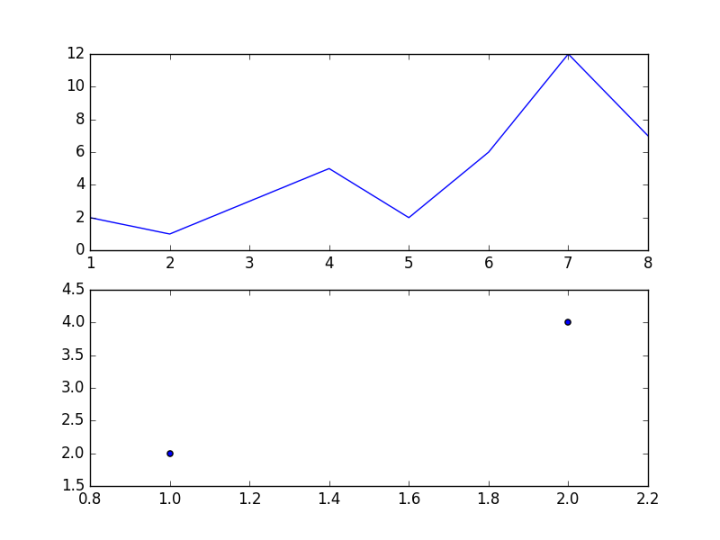

# 数据可视化入门

Matplotlib是Python最著名的数据可视化工具包，有了它，一些统计上常用的图形如折线图、散点图、直方图等都可以用简单的几行Python代码实现。

而Pyplot是Matplotlib里用的最多的工具，他有2个最常用的场景，一个是画点，一个是画线。

## 画点
如果你有一堆的数据样本，想要找出其中的异常值，那么最直观的方法，就是将他们画成散点图，比如


可以很直观地看出右上角的6个点是明显的异常值。

那么用pyplot怎么画点呢？

看以下简单的代码

```python
#导入pyplot包，并简写为plt
import matplotlib.pyplot as plt

#定义2个点的x集合和y集合
x=[1,2]
y=[2,4]

#画散点图
plt.scatter(x,y)

#展示绘画框
plt.show()
```

运行一下会弹出这幅散点图，可以看到画出了两个坐标轴分别为[1,2]，[2,4]的点


然后我们可以利用参数做一些小的调整，比如

```
#调整点的颜色为红色，调整点的形状为x，调整点的大小为30
plt.scatter(x,y,color='red',marker='x',markersize='30')
```

或者可以调整一下坐标轴，加上这句

```python
#[]里的4个参数分别表示X轴起始点，X轴结束点，Y轴起始点，Y轴结束点
plt.axis([0,10,0,10])
```

## 画线
如果我们想了解一些数据的趋势，将数据点跟点之间连成线是最直观的方法，比如PPT里边的折线图，我们可以搬到Python来实现


像这样的图



只需要

```python
#导入pyplot包，并简写为plt
import matplotlib.pyplot as plt

#定义所有点的x集合和y集合
x=[1,2,3,4,5,6,7,8]
y=[2,1,3,5,2,6,12,7]

#画线
plt.plot(x,y)

#展示绘画框
plt.show()
```

简单设置一些参数

```python
#调整线的类型为虚线，加上图标签
plt.plot(x,y,linestyle='--',label='picture')
```

是不是非常的简单？

如果画得熟了，你还可以画人物肖像



## 绘画框划分

有时候，我们想在一个绘画框里同时展现多个图，这时就需要学会对绘画框进行划分。

比如让折线图跟散点图在同一个绘画框展现



用以下简单的2句代码可以实现绘画框的拆分

```python
#导入pyplot包，并简写为plt
import matplotlib.pyplot as plt


#将绘画框进行对象化
fig=plt.figure()

#将p1定义为绘画框的子图，211表示将绘画框划分为2行1列，最后的1表示第一幅图
p1=fig.add_subplot(211)
x=[1,2,3,4,5,6,7,8]
y=[2,1,3,5,2,6,12,7]
p1.plot(x,y)

#将p2定义为绘画框的子图，211表示将绘画框划分为2行1列，最后的2表示第二幅图
p2=fig.add_subplot(212)
a=[1,2]
b=[2,4]
p2.scatter(a,b)

plt.show()
```

